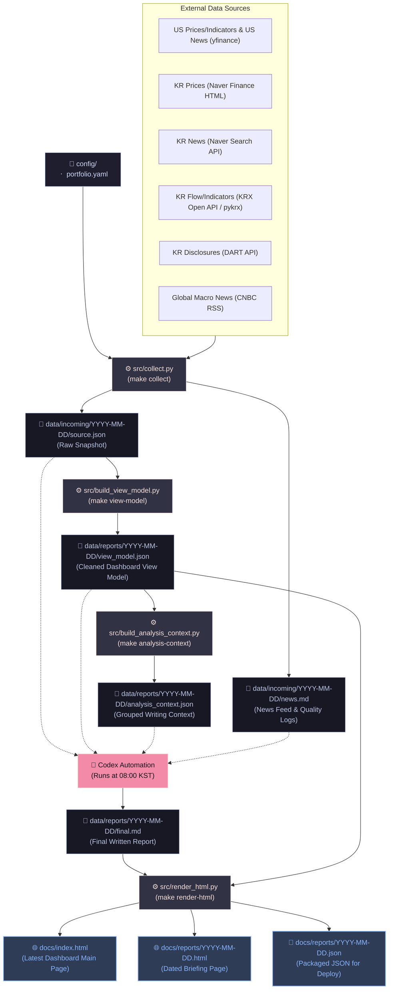

# Morning Investment Briefing

Personal morning investment briefing pipeline.

## v0.1 Flow



### Step-by-Step Pipeline Details

1. **Data Collection**
   - **Command**: `make collect` (triggers `src/collect.py`)
   - **Input**: `config/portfolio.yaml`, external API communications (yfinance, Naver Finance HTML, DART API, KRX Open API/pykrx, etc.)
   - **Output**:
     - `data/incoming/YYYY-MM-DD/source.json` (Full raw data snapshot)
     - `data/incoming/YYYY-MM-DD/news.md` (Deduped raw news feed and collection quality/error logs)

2. **View Model Building**
   - **Command**: `make view-model` (triggers `src/build_view_model.py`)
   - **Input**: `data/incoming/YYYY-MM-DD/source.json`
   - **Output**:
     - `data/reports/YYYY-MM-DD/view_model.json` (Standardized & cleaned schema data suitable for frontend rendering)

3. **Analysis Context Building**
   - **Command**: `make analysis-context` (triggers `src/build_analysis_context.py`)
   - **Input**: `data/reports/YYYY-MM-DD/view_model.json`
   - **Output**:
     - `data/reports/YYYY-MM-DD/analysis_context.json` (Grouped market, sector, holding, news, disclosure, and data-quality context for Codex writing)

4. **Written Briefing Generation (Codex)**
   - **Trigger**: Scheduler triggers Codex Automation at 08:00 KST
   - **Input**: `source.json`, `view_model.json`, `analysis_context.json`, `news.md`
   - **Output**:
     - `data/reports/YYYY-MM-DD/final.md` (Fact-based final briefing markdown report)

5. **HTML Rendering & Packaging**
   - **Command**: `make render-html` (triggers `src/render_html.py`)
   - **Input**: `final.md`, `view_model.json`
   - **Output**:
     - `docs/reports/YYYY-MM-DD.json` (Packaged JSON containing both the report elements and view model data)
     - `docs/reports/YYYY-MM-DD.html` (Static page for the specific date with embedded data for instantaneous loading)
     - `docs/index.html` (Main landing page displaying the latest briefing)


## Local Checks

```bash
make collect-offline
make view-model
make analysis-context
make render-html DATE=YYYY-MM-DD REPORT=data/reports/YYYY-MM-DD/final.md
make test
```

## GitHub Pages Setup

Configure GitHub Pages to serve the `docs/` directory from the main branch. The renderer writes:

```text
docs/index.html
docs/reports/YYYY-MM-DD.html
docs/reports/YYYY-MM-DD.json
```

The HTML frontend embeds the report JSON and `view_model.json` so the page can render both the written briefing and the data dashboard without an extra fetch.

The current frontend is a static JavaScript/CSS app under `docs/assets/`. `view_model.json` drives the first-screen hero, market indicator cards, portfolio table, and SVG line sparklines. `final.md` still provides the written briefing sections below the data dashboard.

`analysis_context.json` is generated from `view_model.json` for Codex report writing. It groups market, sector, holding, news, disclosure, and data-quality context so the written report does not have to infer everything from raw source data.

`data/` outputs are local run artifacts and are intentionally ignored by Git. The GitHub Pages archive should be kept under `docs/`.

After connecting this directory to a GitHub repository:

```bash
git add .
git commit -m "Add morning investment briefing automation"
git push
```

For routine report runs, commit only deployable files:

```text
docs/index.html
docs/reports/YYYY-MM-DD.html
docs/reports/YYYY-MM-DD.json
docs/assets/*
```

Do not commit `data/incoming/` or `data/reports/`; those directories contain local collection and report-generation intermediates.

Then enable GitHub Pages with:

```text
Settings -> Pages -> Build and deployment -> Deploy from a branch -> main / docs
```

## Optional Data Sources

- `yfinance` improves US stock and ETF collection when installed.
- yfinance also collects market indicators: KOSPI, KOSDAQ, Nasdaq, S&P 500, VIX, Gold, USD/KRW, Philadelphia Semiconductor Index.
- yfinance also collects overseas holding news.
- Naver Finance is fetched with a lightweight HTML parser for Korean prices.
- Naver Search API collects Korean holding-specific news when `NAVER_CLIENT_ID` and `NAVER_CLIENT_SECRET` are set.
- KRX Open API can add domestic investor flow when `KRX_AUTH_KEY` and the approved investor-flow API paths are set.
- CNBC RSS is fetched with Python standard library XML parsing for global market context.
- DART disclosures are collected when `DART_API_KEY` is set.
- Preferred shares use common-stock DART lookup fallbacks where needed.

## Local Secrets

Do not commit API keys. Put local keys in `.env`:

```bash
DART_API_KEY=your_key_here
NAVER_CLIENT_ID=your_client_id_here
NAVER_CLIENT_SECRET=your_client_secret_here
KRX_AUTH_KEY=your_krx_auth_key_here
KRX_OPEN_API_BASE=https://data-dbg.krx.co.kr/svc/apis
KRX_ID=your_krx_login_id_here
KRX_PW=your_krx_login_password_here
KRX_INVESTOR_MARKET_API_PATH=
KRX_INVESTOR_HOLDING_API_PATH=
```

The collector skips DART and records `DART_API_KEY not set` when the key is missing.

KRX investor flow is optional. Without local `KRX_AUTH_KEY`, it is skipped. If KRX has not granted investor-flow APIs, leave `KRX_INVESTOR_MARKET_API_PATH` and `KRX_INVESTOR_HOLDING_API_PATH` blank.
For KRX sample tests, temporarily set `KRX_OPEN_API_BASE=https://data-dbg.krx.co.kr/svc/sample/apis`.
When KRX Open API is unavailable, `KRX_ID` and `KRX_PW` enable a pykrx fallback for domestic prices, indices, and investor flow.
