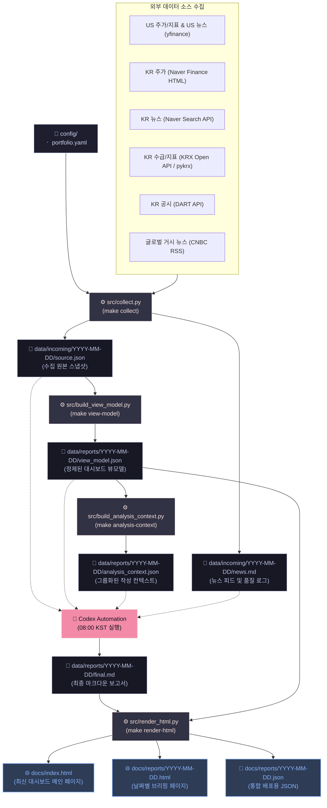

# 아침 투자 브리핑 (Morning Investment Briefing)

개인용 아침 투자 브리핑 파이프라인.

## v0.1 흐름 (Flow)



### 단계별 상세 정보

1. **데이터 수집 (Data Collection)**
   - **실행**: `make collect` (내부적으로 `src/collect.py` 구동)
   - **입력**: `config/portfolio.yaml`, 외부 API 통신 (yfinance, 네이버 금융, DART, KRX 등)
   - **출력**:
     - `data/incoming/YYYY-MM-DD/source.json` (수집 완료된 전체 원본 데이터 스냅샷)
     - `data/incoming/YYYY-MM-DD/news.md` (중복 제거된 원본 뉴스 피드 및 수집 품질 정보)

2. **뷰모델 정제 (View Model Building)**
   - **실행**: `make view-model` (내부적으로 `src/build_view_model.py` 구동)
   - **입력**: `data/incoming/YYYY-MM-DD/source.json`
   - **출력**:
     - `data/reports/YYYY-MM-DD/view_model.json` (대시보드 차트 및 표 렌더링에 적합하도록 정제/표준화된 스키마 데이터)

3. **분석 컨텍스트 생성 (Analysis Context Building)**
   - **실행**: `make analysis-context` (내부적으로 `src/build_analysis_context.py` 구동)
   - **입력**: `data/reports/YYYY-MM-DD/view_model.json`
   - **출력**:
     - `data/reports/YYYY-MM-DD/analysis_context.json` (시장, 섹터, 종목, 뉴스, 공시, 데이터 품질 컨텍스트)

4. **서면 브리핑 작성 (Written Briefing - Codex)**
   - **실행**: 08:00 KST 스케줄러 기반 Codex Automation 작동
   - **입력**: `source.json`, `view_model.json`, `analysis_context.json`, `news.md`
   - **출력**:
     - `data/reports/YYYY-MM-DD/final.md` (팩트 기반의 최종 마크다운 보고서)

5. **HTML 렌더링 및 패키징 (HTML Rendering & Packaging)**
   - **실행**: `make render-html` (내부적으로 `src/render_html.py` 구동)
   - **입력**: `final.md`, `view_model.json`
   - **출력**:
     - `docs/reports/YYYY-MM-DD.json` (프론트엔드 로드를 위해 보고서 데이터와 뷰모델이 하나로 병합된 파일)
     - `docs/reports/YYYY-MM-DD.html` (해당 날짜의 브리핑 웹페이지, 데이터가 임베딩되어 지연 없이 렌더링)
     - `docs/index.html` (가장 최신의 브리핑을 보여주는 메인 페이지)


## 로컬 확인 (Local Checks)

```bash
make collect-offline
make view-model
make analysis-context
make render-html DATE=YYYY-MM-DD REPORT=data/reports/YYYY-MM-DD/final.md
make test
```

## GitHub Pages 설정 (Setup)

main 브랜치의 `docs/` 디렉토리를 서비스하도록 GitHub Pages를 설정합니다. 렌더러는 다음을 생성합니다:

```text
docs/index.html
docs/reports/YYYY-MM-DD.html
docs/reports/YYYY-MM-DD.json
```

HTML 프론트엔드는 추가적인 fetch 요청 없이 서면 브리핑과 데이터 대시보드를 모두 렌더링할 수 있도록 보고서 JSON과 `view_model.json`을 내장(embed)합니다.

현재 프론트엔드는 `docs/assets/` 아래에 있는 정적 JavaScript/CSS 앱입니다. `view_model.json`은 첫 화면 히어로(hero), 시장 지표 카드, 포트폴리오 표, 그리고 SVG 라인 스파크라인을 구동합니다. 데이터 대시보드 아래의 서면 브리핑 섹션은 여전히 `final.md`에서 제공합니다.

`data/` 아래 산출물은 로컬 실행 중간물이며 Git에서 의도적으로 제외합니다. GitHub Pages 아카이브는 `docs/` 아래 파일로 관리합니다.

이 디렉토리를 GitHub 리포지토리에 연결한 후:

```bash
git add .
git commit -m "Add morning investment briefing automation"
git push
```

일상적인 리포트 실행 후에는 배포 가능한 파일만 커밋합니다:

```text
docs/index.html
docs/reports/YYYY-MM-DD.html
docs/reports/YYYY-MM-DD.json
docs/assets/*
```

`data/incoming/` 또는 `data/reports/`는 수집/작성 중간물이므로 커밋하지 않습니다.

그 후 다음과 같이 GitHub Pages를 활성화합니다:

```text
Settings -> Pages -> Build and deployment -> Deploy from a branch -> main / docs
```

## 선택적 데이터 소스 (Optional Data Sources)

- `yfinance` 설치 시 미국 주식 및 ETF 수집 기능이 향상됩니다.
- 또한 yfinance는 시장 지표(KOSPI, KOSDAQ, Nasdaq, S&P 500, VIX, 금, USD/KRW, 필라델피아 반도체 지수)를 수집합니다.
- yfinance는 해외 보유 자산 뉴스도 수집합니다.
- 네이버 금융은 한국 주식 가격 수집을 위해 가벼운 HTML 파서로 가져옵니다.
- `NAVER_CLIENT_ID` 및 `NAVER_CLIENT_SECRET`이 설정되면 네이버 검색 API를 통해 한국 보유 자산별 뉴스를 수집합니다.
- `KRX_AUTH_KEY`와 승인된 투자자별 거래실적 API 경로가 설정되면 KRX Open API를 통해 국내 투자자 동향을 추가할 수 있습니다.
- 글로벌 시장 맥락을 파악하기 위해 Python 표준 라이브러리 XML 파싱으로 CNBC RSS를 가져옵니다.
- `DART_API_KEY`가 설정되면 DART 공시 정보를 수집합니다.
- 우선주는 필요한 경우 보통주 DART 조회 대체(fallback) 방식을 사용합니다.

## 로컬 비밀키 (Local Secrets)

API 키를 커밋하지 마세요. 로컬 키는 `.env` 파일에 저장합니다:

```bash
DART_API_KEY=your_key_here
NAVER_CLIENT_ID=your_client_id_here
NAVER_CLIENT_SECRET=your_client_secret_here
KRX_AUTH_KEY=your_krx_auth_key_here
KRX_OPEN_API_BASE=https://data-dbg.krx.co.kr/svc/apis
KRX_ID=your_krx_login_id_here
KRX_PW=your_krx_login_password_here
KRX_INVESTOR_MARKET_API_PATH=
KRX_INVESTOR_HOLDING_API_PATH=
```

키가 누락된 경우, 수집기는 DART 수집을 건너뛰고 `DART_API_KEY not set`으로 기록합니다.

KRX 투자자 동향은 선택 사항입니다. 로컬 `KRX_AUTH_KEY`가 없으면 건너뜁니다. KRX가 투자자 동향 API 권한을 승인하지 않았다면, `KRX_INVESTOR_MARKET_API_PATH` 및 `KRX_INVESTOR_HOLDING_API_PATH`를 빈칸으로 두십시오.
KRX 샘플 테스트의 경우, 일시적으로 `KRX_OPEN_API_BASE=https://data-dbg.krx.co.kr/svc/sample/apis`로 설정합니다.
KRX Open API를 사용할 수 없는 경우, `KRX_ID` 및 `KRX_PW`를 설정하면 국내 주가, 지수 및 투자자 동향을 수집하기 위해 pykrx 대체(fallback) 수단이 활성화됩니다.
